# Simple 2D World Builder

A lightweight, grid-based world building component package for Unity 2D games. This package provides a complete set of tools to help you design, place, and manage your 2D game worlds directly within the Unity Editor.

---

## Table of Contents

1. [Overview](#overview)
2. [Features](#features)
3. [Installation](#installation)
4. [Setup & Configuration](#setup--configuration)
5. [Using the Scene Tools](#using-the-scene-tools)
6. [Using the Custom Editor Window](#using-the-custom-editor-window)
7. [Saving and Reloading Levels](#saving-and-reloading-levels)
8. [Best Practices & Tips](#best-practices--tips)
9. [Known Issues & Troubleshooting](#known-issues--troubleshooting)

---

## Overview

The **Simple 2D World Builder** package is designed to help developers rapidly create and edit 2D game worlds within Unity. It features an intuitive grid system, automatic tile scaling, a painting/erasing tool with adjustable brush sizes, and a custom editor window for quick actions. This component package is perfect for prototyping levels, building static game environments, or even creating fully dynamic worlds.

---

## Features

- **Grid System:** 
  - Configurable grid dimensions (grid width and height) and cell size.
  - Visual grid overlay in the Scene view using Gizmos.
  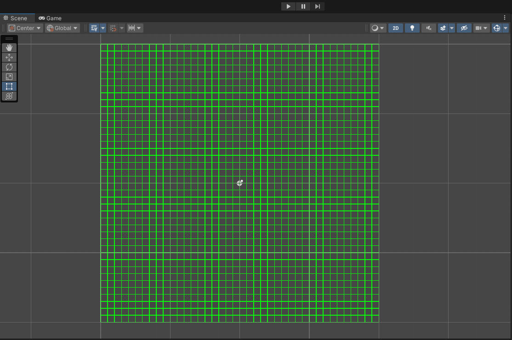

- **Tile Placement:**
  - Place tiles by clicking on the grid.
  - Auto-adjust tile sprite scale to fill the grid cell.
  - Right-click erase functionality.
  - Option to replace existing tiles by placing a new tile on an occupied cell.
  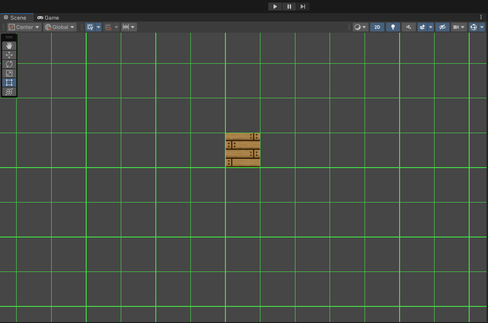

- **Brush Tools:**
  - Adjustable brush radius to "paint" larger areas with a single drag.
  - Supports both painting and erasing multiple tiles at once.
  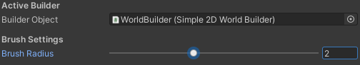

- **Editor Enhancements:**
  - Custom Editor Window with a tile palette preview, quick action buttons (clear all, recalc, repaint).
  - Brush settings (slider to control brush radius).
  - Built-in support for Undo/Redo using UnityEditor utilities.
  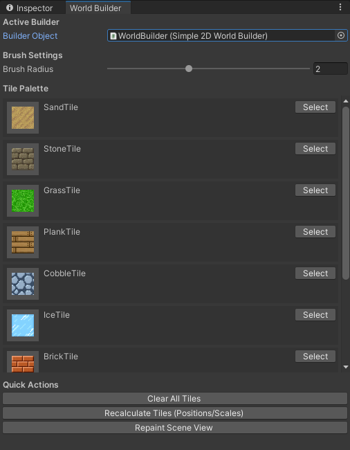

- **Persistence and Saving:**
  - Tiles are saved as part of the scene.
  - On scene load, the package automatically rebuilds its internal dictionary so that all placed tiles become erasable and adjustable.
  
---

## Installation

1. **Download and Import the Package:**
   - Download the Simple 2D World Builder package.
   - In Unity, go to **Assets > Import Package > Custom Package...** and select the downloaded package.
   - Make sure all scripts and editor folders are imported into your project.
   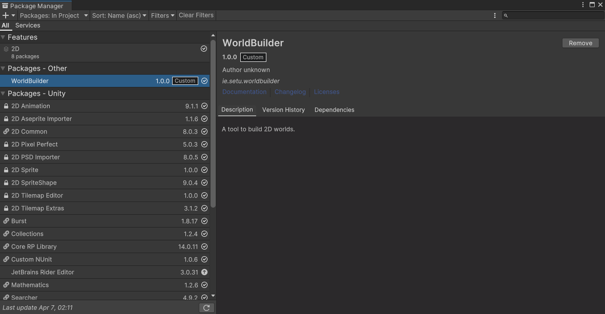

2. **Folder Structure:**
   - **Scripts Folder:** Contains runtime scripts such as `Simple2DWorldBuilder.cs` and `Tile2D.cs`.
   - **Editor Folder:** Contains editor scripts such as `Simple2DWorldBuilderEditor.cs` and `WorldBuilderWindow.cs`.
   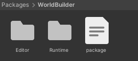

---

## Setup & Configuration

1. **Add the World Builder Component:**
   - In your scene, create an empty GameObject (e.g., named `WorldBuilder`).
   - Attach the `Simple2DWorldBuilder` component to the GameObject.
   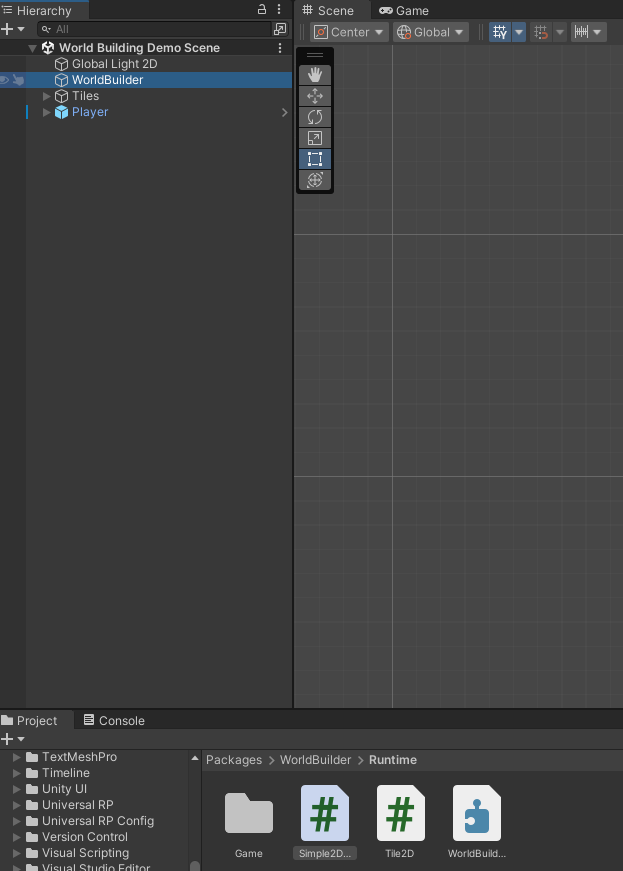

2. **Configure Grid Settings:**
   - Set your desired **grid width**, **grid height**, and **cell size** in the Inspector.
   - Adjust the **brush radius** (0 for single cell, 1 for a 3×3 block, etc.) as needed.
   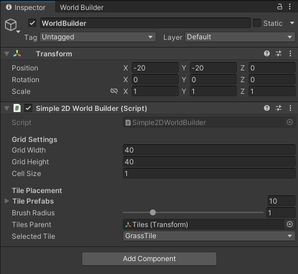

3. **Tile Placement Setup:**
   - Populate the **tilePrefabs** array with your tile prefabs.
   - (Optional) Create a dedicated GameObject (e.g., named `Tiles`) to serve as the parent for all placed tiles and assign it to the **tilesParent** field.
   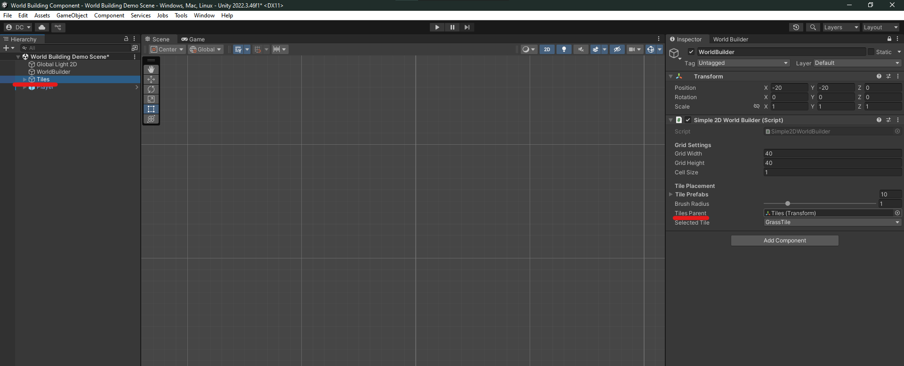

---

## Using the Scene Tools

### Placing and Erasing Tiles

- **Left-click** (or drag) on the grid in the Scene view to place tiles.
  - The system calculates the cell based on your click position.
  - If a tile already exists in that cell, it is replaced with the new tile.
  
- **Right-click** (or drag) on the grid to erase tiles.
  - Tiles are removed from both the scene and the internal dictionary.
  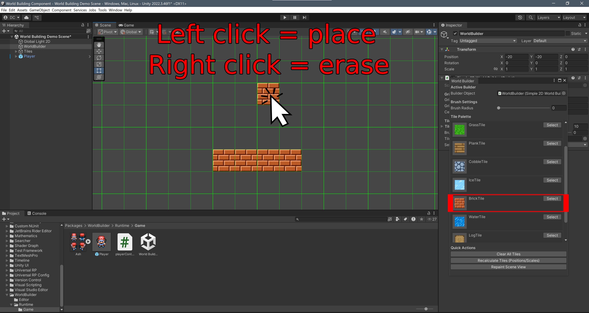

### Brush Support

- When holding down the mouse button, the tool will paint or erase all cells within the current brush radius.
- The brush radius can be adjusted via the custom editor window (see next section).
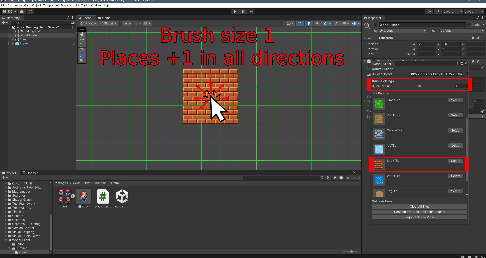
---

## Using the Custom Editor Window

1. **Open the World Builder Window:**
   - Navigate to **Tools > World Builder Window** in the Unity menu.
   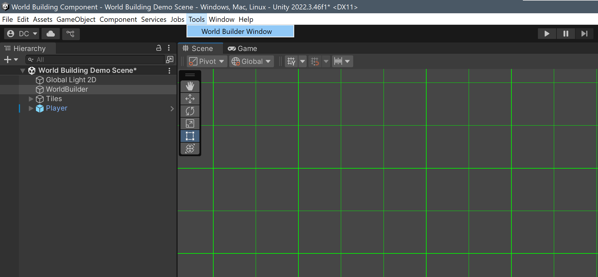

2. **Assign the Active Builder:**
   - In the window, drag your `WorldBuilder` GameObject into the "Builder Object" field.
   - This connects the window to your active world builder.
   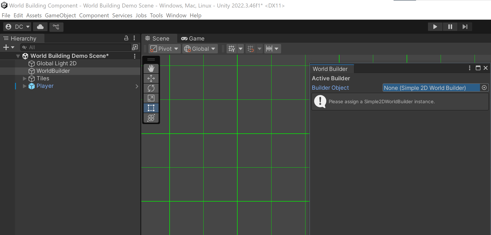

3. **Tile Palette:**
   - View a scrollable tile palette showing thumbnails of your available tile prefabs.
   - Click **"Select"** on a tile to set it as the active tile for placement.
   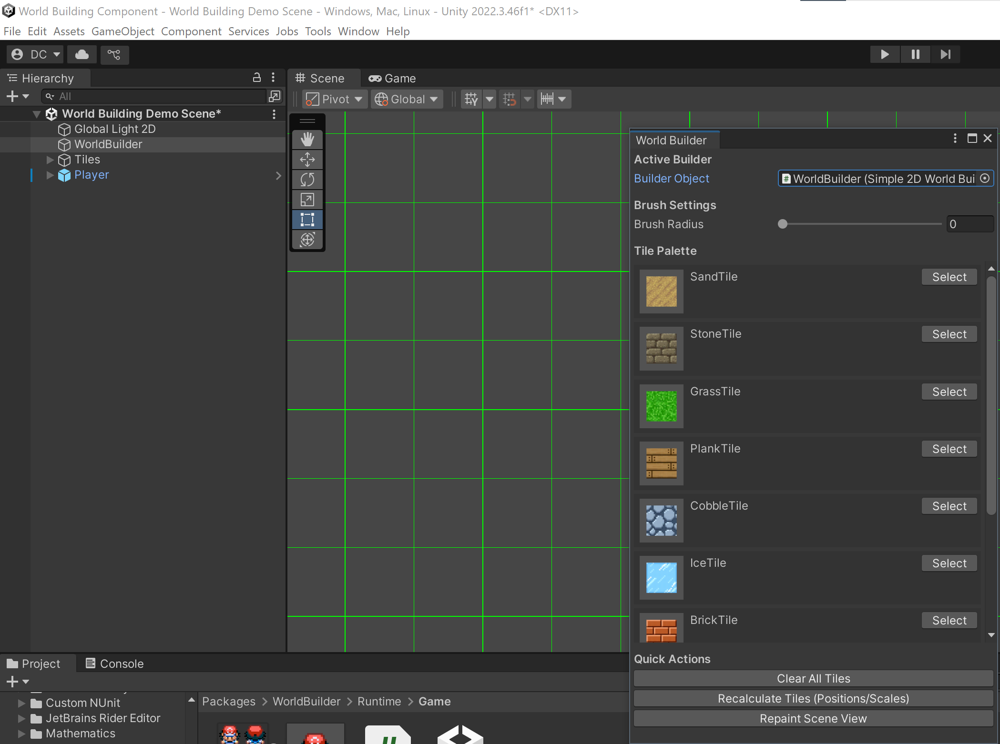
4. **Brush Settings:**
   - Adjust the **Brush Radius** slider to change how many cells are painted/erased at once.
   

5. **Quick Actions:**
   - **Clear All Tiles:** Removes every placed tile, and also clears all children under the designated `tilesParent`.
   - **Recalculate Tiles:** Repositions and resizes all placed tiles to match any changes to the grid settings.
   - **Repaint Scene View:** Forces an update of the Scene view to reflect recent changes.
   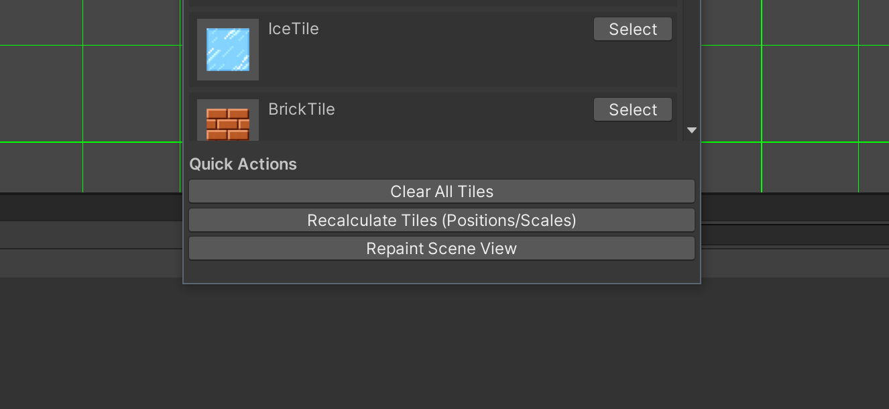

---

## Saving and Reloading Levels

- **Scene Persistence:**
  - All placed tile GameObjects are saved as part of the scene.
  - The `Tile2D` component attached to each tile stores its grid coordinate, and these values are serialized.
  
- **Automatic Dictionary Rebuild:**
  - When the scene is reloaded (or Unity is reopened), the `OnEnable()` method in `Simple2DWorldBuilder` scans the `tilesParent` for any child with a `Tile2D` component.
  - The internal `placedTiles` dictionary is rebuilt so that all previously placed tiles can be managed (e.g., erased or recalculated).

- **Usage Note:**
  - If you experience issues with tiles not being erasable upon scene reload, use the **Clear All Tiles** button in the World Builder Window to refresh the state. The rebuilt dictionary ensures future modifications work as expected.

  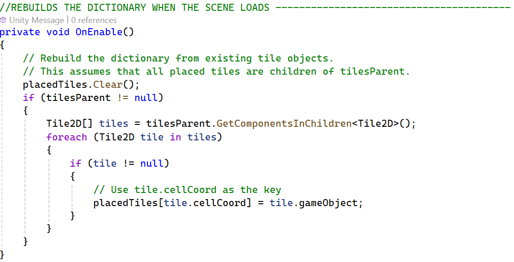

---

## Best Practices & Tips

- **Consistent Sprite Settings:**
  - Ensure your tile prefabs have proper sprite import settings (e.g., correct Pixels Per Unit) so that auto-scaling works as expected.
  
- **Organize Hierarchy:**
  - Use a dedicated `tilesParent` GameObject to keep the scene hierarchy tidy. This is especially useful for large levels.

- **Undo Support:**
  - Leverage the Editor's Undo/Redo functionality. Use the provided editor scripts to support Undo for tile placement and removal.

- **Testing:**
  - Regularly test changes in both Edit Mode and Play Mode to ensure consistency in tile behavior.

  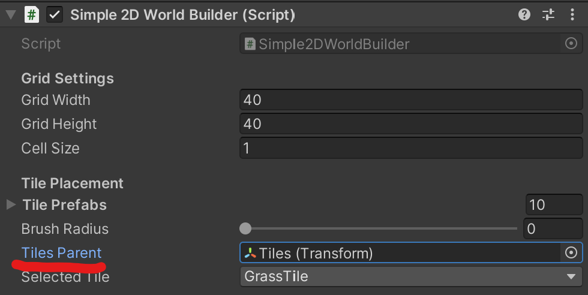
  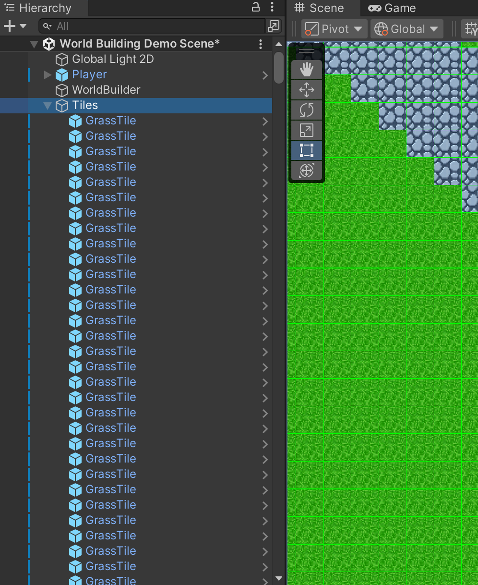

---

## Known Issues & Troubleshooting

- **Tile Persistence Issues:**
  - If tiles placed before saving are not erasable upon reloading the scene, verify that the `OnEnable()` method is correctly rebuilding the dictionary from the children of `tilesParent`.
  - Use the **Clear All Tiles** button to force a cleanup if needed.

- **Editor-Only API:**
  - The package uses Editor-only classes (e.g., `PrefabUtility`, `Undo`). Ensure your code is properly wrapped with `#if UNITY_EDITOR` to avoid build issues.

  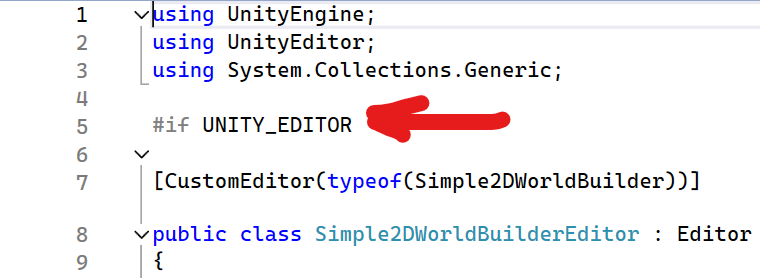
  
---

## Conclusion

The Simple 2D World Builder package provides a robust and flexible system for creating and editing 2D game worlds in Unity. By following this guide, developers can quickly integrate the package into their projects, utilize its painting and erasing tools, and take advantage of the custom editor window for streamlined level design.

  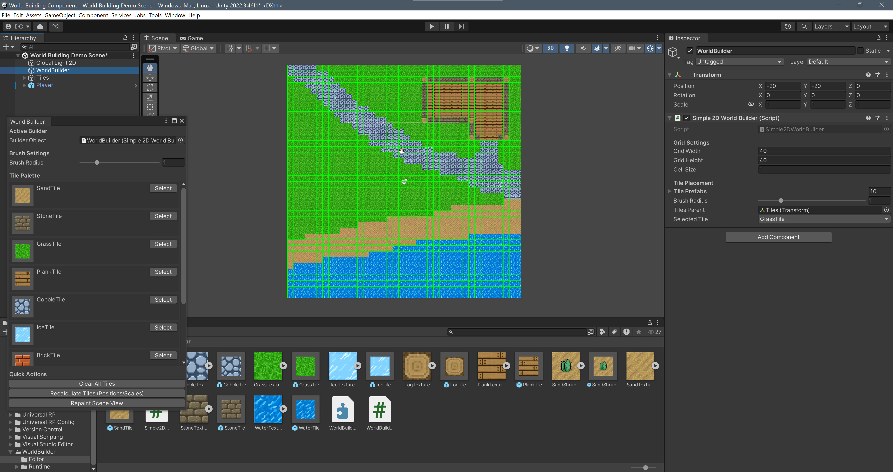